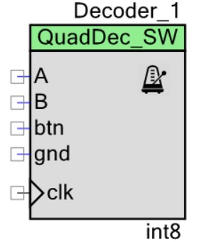
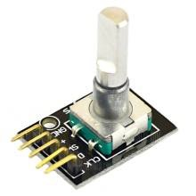

==Features

* Implements quadrature decoder for rotary shaft encoders.
* Returns position and direction of rotation.
* 8-bit, 16-bit, 32-bit, single or double position range.
* Optional button switch with debouncing.
* Optional increment step size.
* Optional range limits.
* Uses interrupt or polling technique.

[[general-description]]
General description
-------------------

The QuadDec_SW component(*) represents quadrature decoder with optional
button switch detection implemented entirely in software code (no UDB
resources used). It can detect position of the rotary encoder and
direction of rotation of mechanical shaft encoders using established
algorithm link:#bookmark0[[1]]. Range selection (8,16,32-bit, single,
double) and limit bounds option allow for simple interfacing with other
PSoC components (VDAC8, PWM, etc.). Multiple instances of component can
run simultaneously in the project interfacing several encoders.

[[when-to-use-decoder-component]]

       When to use Decoder
component
^^^^^^^^^^^^^^^^^^^^^^^^^^^^^^^^^^^^^^^^^^^^^^^^^^^^^^^^^^^^^^^^^^^^^^^^^^^^^^

______________________________________________________________________________________________________________________________________________________________________________________________________________________________________________________________________________________________________________
Component was developed for interfacing hand-operated rotary shaft
encoders with PSoC projects with limited UDB resources. It is
particularly useful when developing custom Verilog/Datapath code as it
does not hide UDB resources consumption. Component was tested on PSoC4
and PSoC5 prototyping kits with

encoders having 15-24 detents/revolution. Typical applications are HMI
interface (such as LCD menu) or parameter input (servo position, volume
control etc.). Component is not intended for critical applications, such
as motor feedback control. Demo projects are provided.
______________________________________________________________________________________________________________________________________________________________________________________________________________________________________________________________________________________________________________

[[input-output-connections]]
Input-output connections
------------------------

[[ab-encoder-line-ab]]
A(B) – encoder line A(B)
~~~~~~~~~~~~~~~~~~~~~~~~

____________________________________________________________________________________________________________________________________________________________________________________________________________________________________________________________________________________________________________________________________________________________________________________
External terminal for connecting A(B) line from the encoder annotation
component (off-chip). The pin is always visible. Pin does not have to be
connected, it is merely an external terminal to the annotation
component. Actual assignment of the input pin is performed using Pins
dialog on the Design Wide Resources (DWR) page. See Functional
Description section for details.
____________________________________________________________________________________________________________________________________________________________________________________________________________________________________________________________________________________________________________________________________________________________________________________

[[btn-button-switch]]
Btn – button switch
~~~~~~~~~~~~~~~~~~~

_______________________________________________________________________________________________________________________________________________________________________________________________________________________________________________________________________________________________________________________________________________________________________________________________________________________
External terminal for connecting to a switch button on the encoder
annotation component (off- chip). Visibility of this pin is controlled
by the *btn_enable* option in the Advanced dialog. The pin does not have
to be connected, it is merely an external terminal to the annotation
component. Actual assignment of the button pin is performed in the Pins
dialog. See Functional Description section for details.
_______________________________________________________________________________________________________________________________________________________________________________________________________________________________________________________________________________________________________________________________________________________________________________________________________________________

[[gnd-virtual-ground]]
gnd – virtual ground
~~~~~~~~~~~~~~~~~~~~

_______________________________________________________________________________________________________________________________________________________________________________________________________________________________________________________________________________________________________________________________________________________________________________________________________________________
External terminal for connecting to a ground terminal on the encoder
annotation component (off-chip). Visibility of this pin is controlled by
the *gnd_enable* option in the Advanced dialog. The pin does not have to
be connected, it is merely an external terminal to the annotation
component. Actual assignment of the input pin is performed in the Pins
dialog. See Functional Description section for details.
_______________________________________________________________________________________________________________________________________________________________________________________________________________________________________________________________________________________________________________________________________________________________________________________________________________________

[[clk-clock-input]]
clk – clock input
~~~~~~~~~~~~~~~~~

_________________________________________________________________________________________________________________________________________________________________________________________________________________________________________________________________________________________________________________________________________________________________________________________________________________________________________________________________________________________________________________________________________________________________________________________________________________________________________________________________________________________________________
In polling mode the encoder pins are sampled on rising edge of this
signal. In interrupt mode the clock is used only for debouncing of the
switch button(*). In the polling mode the pin is visible when internal
interrupt option is selected; in the interrupt mode this pin is visible
when button is enabled. When visible, the pin must be connected to a
clock. Recommended frequency of the clock source must be about 1-2 kHz.
Increasing sampling rate improves encoder position accuracy (in polling
mode), but shortens debouncing time. In PSoC4 this pin can’t be directly
driven by a clock and has to be bypassed using either UDB component or a
pin. Such bypass consumes one macrocell.

image:media/image3.jpeg[image,width=631,height=153]

*Figure 1. Clock connection: (A) PSoC5 - direct, (B, C) PSoC4 -
bypassed.*
_________________________________________________________________________________________________________________________________________________________________________________________________________________________________________________________________________________________________________________________________________________________________________________________________________________________________________________________________________________________________________________________________________________________________________________________________________________________________________________________________________________________________________

[[parameters-and-settings]]
Parameters and Settings
-----------------------

______________________________________________
Basic dialog provides following parameters(*):
______________________________________________

image:media/image4.png[image,width=381,height=283]

[[check_bounds-bool]]
check_bounds (bool)
^^^^^^^^^^^^^^^^^^^

___________________________________________________________________________________________________________________________________________________________________________________________________________________________________________________________________________________________________________________________________________________________________________________
Enables lower and upper bounds for encoder position. Default value is
false. If enabled, encoder position will be restricted to interval from
*lower_bound* to *upper_bound*, saturating at bound limits. If disabled,
position change is unrestricted, and will flip over range type limits.
For example, for encoder range type *int8*, next position up from 127 is
-128, etc.).
___________________________________________________________________________________________________________________________________________________________________________________________________________________________________________________________________________________________________________________________________________________________________________________

[[encoder_range-int8-int16-int32-uint8-uint16-uint32-single-double]]
encoder_range (int8 / int16 / int32 / uint8 / uint16 / uint32 / single /
double)
^^^^^^^^^^^^^^^^^^^^^^^^^^^^^^^^^^^^^^^^^^^^^^^^^^^^^^^^^^^^^^^^^^^^^^^^^^^^^^^^

_______________________________________________________________________________________________________________________________________________________________________________________
Encoder position range type *er_t* (int8, int16, int32, uint8, uint16,
uint32, single or double). For example, valid range for position values
using *er_t* = int8 is from -128 to 127.
_______________________________________________________________________________________________________________________________________________________________________________________

[[increment-er_t]]
increment (er_t)
^^^^^^^^^^^^^^^^

_____________________________________________________________________________________________________________________________________________________________________________________________________________________________________________________________________________________________________________________________________________________
Encoder step increment. Must be of positive non-zero value. Default
value is 1. When *check_bounds* option is selected, the position will
not change if incrementing it causes bound overflow. For example, if
**start_position**=0, **increment**=10 and **upper_bound**=255, encoder
position can reach maximum value of 250 (can’t step over 255).
_____________________________________________________________________________________________________________________________________________________________________________________________________________________________________________________________________________________________________________________________________________________

[[lower_bound-er_t]]
lower_bound (er_t)
^^^^^^^^^^^^^^^^^^

___________________________________________________________________________________
Encoder lowest position. To have effect, the *check_bounds* option must
be enabled.
___________________________________________________________________________________

[[start_position-er_t]]
start_position (er_t)
^^^^^^^^^^^^^^^^^^^^^

___________________________________________________________________________________________
Encoder position upon initialization. If *check_bounds* option is
enabled, the value of the

*start_position* must reside between *lower_bound* and *upper_bound*.
___________________________________________________________________________________________

[[upper_bound-er_t]]
upper_bound (er_t)
^^^^^^^^^^^^^^^^^^

____________________________________________________________________________________
Encoder highest position. To have effect, the *check_bounds* option must
be enabled.

Advanced dialog provides following parameters:
____________________________________________________________________________________

image:media/image5.png[image,width=381,height=282]

[[btn_enable-bool]]
btn_enable (bool)
^^^^^^^^^^^^^^^^^

____________________________________________________________________________________________________________________________________________________________________________
Enables button pressed event. Default value is True. In interrupt mode
this feature will consume extra interrupt for switch debouncing. See
*Resources* section for details.
____________________________________________________________________________________________________________________________________________________________________________

[[gnd_enable-bool]]
gnd_enable (bool)
^^^^^^^^^^^^^^^^^

______________________________________________________________________________________________________________________________________________________________________________________________________________________________________________________________________________________________________
Enables virtual ground though extra pin (open drain drives low). Default
value is true. This feature is convenient when working with PSoC
prototyping kits where ground terminals are limited. This feature
consumes extra pin on PSoC. If enabled, the *gnd* external terminal
appears on the symbol.
______________________________________________________________________________________________________________________________________________________________________________________________________________________________________________________________________________________________________

[[input_mode-resistive-pull-up-high-impedance]]
input_mode (resistive pull up / high impedance)
^^^^^^^^^^^^^^^^^^^^^^^^^^^^^^^^^^^^^^^^^^^^^^^

_________________________________________________________________________________________________________________________________________________________________________________________________________________________________________________________________________________________________________________________
Sets input pins either to *resistive pull up* or *high impedance*
digital drive mode. Default value is *resistive pull up*. Select *high
impedance* option when encoder has external pullup resistors; select
*resistive pull up* option when encoder is a bare switch. See
*Functional Description* section for details.
_________________________________________________________________________________________________________________________________________________________________________________________________________________________________________________________________________________________________________________________

[[invert_direction-bool]]
invert_direction (bool)
^^^^^^^^^^^^^^^^^^^^^^^

________________________________________________________________________________________________________________________________________________________________________________________________________________________________________________________________________________________________________________________________________________________________
Allows revering direction of the encoder in code. Default value is
false. This feature has same effect as switching up encoder terminals A
and B. It appears that various shaft encoders may have either line A or
line B as leading edge source, resulting either in increment or
decrement while rotating clockwise. This option allows correcting that
issue.
________________________________________________________________________________________________________________________________________________________________________________________________________________________________________________________________________________________________________________________________________________________________

[[state_check-polling-interrupt]]
state_check (polling / interrupt)
^^^^^^^^^^^^^^^^^^^^^^^^^^^^^^^^^

_____________________________________________________________________________________________________________________________________________________________________________________________________________________________________________________________________________________________________________________________________________________________________________________________________________________________________________________________________________________________________________________________________________________________________________
Method of detection of the encoder state change: repeatedly polling pins
state or waiting for pin interrupt. Using interrupts consumes less CPU
resources but is limited by only one encoder per port, and pins
assignment has to be contiguous. The polling method poses no
restrictions on number of encoders per port and on pins assignment, but
consumes extra CPU resources. This may become significant when large
numbers of encoders are used or when CPU is heavily loaded by other
processes. See *Functional Description* and *Performance* sections for
details.
_____________________________________________________________________________________________________________________________________________________________________________________________________________________________________________________________________________________________________________________________________________________________________________________________________________________________________________________________________________________________________________________________________________________________________________

image:media/image6.jpeg[image,width=388,height=134]

_________________________________________________________________________________________________________________________________________________________________________________
*Figure 2. Component appearance in polling and interrupt modes:
(a)-polling mode, timer clock appears on the symbol; (b)-interrupt mode,
interrupt symbol appears on the symbol.*
_________________________________________________________________________________________________________________________________________________________________________________

[[timer_isr-internal-external]]
timer_isr (internal / external)
^^^^^^^^^^^^^^^^^^^^^^^^^^^^^^^

___________________________________________________________________________________________________________________________________________________________________________________________________________________________________________________________________________________
Select internal or external timer interrupt for polling of encoder pins.
This option available only for polling mode. Internal option requires
less code, but consumes extra interrupt for each Decoder component,
which but can be prohibitive when large number of encoders used.

External option allows for a single interrupt polling all encoders in
the project, but requires extra custom code(*). When selected, the clock
input becomes hidden. Default option is internal.

* See Multiple Encoders example in the Application Note
___________________________________________________________________________________________________________________________________________________________________________________________________________________________________________________________________________________

[[application-programming-interface]]
Application Programming Interface
---------------------------------

[cols=",",options="header",]
|==================================
a|
__________
*Function*
__________

 a|
_____________
*Description*
_____________

|Decoder_Start() a|
______________________________
Initialize and start component
______________________________

|Decoder_Stop() a|
______________
Stop component
______________

|Decoder_SetPosition() a|
_____________________
Sets encoder position
_____________________

|Decoder_SetIncrement() a|
____________________________
Sets position increment step
____________________________

|Decoder_SetBounds() a|
___________________________
Sets lower and upper bounds
___________________________

|Decoder_SetCheckBounds() a|
____________________________
Sets *check_bounds* property
____________________________

|Decoder_Setup() a|
___________________________________
Sets position, increment and bounds
___________________________________

|Decoder_CheckStatus() a|
______________________________
Step through the state machine
______________________________

a|
__________
*Variable*
__________

 a|
_____________
*Description*
_____________

|Decoder_Position a|
________________
Encoder position
________________

|Decoder_Direction a|
__________________________________
Encoder last direction of rotation
__________________________________

|Decoder_PositionChanged a|
_____________________
Position changed flag
_____________________

|Decoder_BtnPressed a|
___________________
Button pressed flag
___________________

|Decoder_Initialized a|
____________________________
Component initialized status
____________________________

|Decoder_Enabled a|
______________________
Decoder enabled status
______________________

|Decoder_Increment a|
_______________________
Position increment step
_______________________

|Decoder_LowerBound a|
____________________
Position lower bound
____________________

|Decoder_UpperBound a|
____________________
Position upper bound
____________________

|Decoder_CheckBounds a|
____________________________
Decoder *check_bounds* state
____________________________

|==================================

[[void-decoder_start]]
void Decoder_Start()
~~~~~~~~~~~~~~~~~~~~

_____________________________________________________________________________________________________________________________________________________
*Description:* Initializes and starts component. Sets input pins drive
mode (resistive pull up / high impedance) according to *input_mode*
selection.

*Parameters:* none

*Return Value:* none
_____________________________________________________________________________________________________________________________________________________

[[void-decoder_stop]]
void Decoder_Stop()
~~~~~~~~~~~~~~~~~~~

______________________________________________________________________________________________________________________________
*Description:* Stops and disables component. Stops internal interrupts
and sets input pins drive mode to high impedance state.

*Parameters:* none

*Return Value:* none
______________________________________________________________________________________________________________________________

[[uint8-decoder_setpositioner_t-value]]
uint8 Decoder_SetPosition(er_t value)
~~~~~~~~~~~~~~~~~~~~~~~~~~~~~~~~~~~~~

___________________________________________________________________________________________________________________________________________________________________________________________
*Description:* Sets encoder position.

*Parameters:* new encoder position, must be of defined encoder range
type *er_t*(***). If *check_bounds* option is enabled, the value must be
in range from *lower_bound* to *upper_bound*.

*Return Value:* 1- if set value is within the range, otherwise return is
0.
___________________________________________________________________________________________________________________________________________________________________________________________

[[uint8-decoder_setincrement-er_t-value]]
uint8 Decoder_SetIncrement (er_t value)
~~~~~~~~~~~~~~~~~~~~~~~~~~~~~~~~~~~~~~~

______________________________________________________________________________________________________________________________________________
*Description:* Sets position increment step.

*Parameters:* non-zero, positive value, must be of selected encoder
range type *er_t*. *Return Value:* 1- if value > 0, otherwise return is
0.
______________________________________________________________________________________________________________________________________________

[[uint8-decoder_setbounds-er_t-lower_bound-er_t-upper_bound]]
uint8 Decoder_SetBounds (er_t lower_bound, er_t upper_bound)
~~~~~~~~~~~~~~~~~~~~~~~~~~~~~~~~~~~~~~~~~~~~~~~~~~~~~~~~~~~~

________________________________________________________________________________________________________________________________________________________________________________________________________________________________________________________________________________________________________________________________________________________________________
*Description:* Sets encoder *lower_bound* and *upper_bound*.

*Parameters: lower_bound* and *upper_bound* must be of selected encoder
range type *er_t*, satisfying condition *lower_bound* <= *upper_bound*.
Note that changing the bounds will not update encoder position
automatically, and may result in position falling outside of the bound
limits. Use API SetPosition() to update the position right after
SetBounds() call.

*Return Value:* 1 – if *lower_bound* < *upper_bound*, otherwise return
value is 0.

* *er_t* is of type int8, int16, int32, uint8, uint16, uint32, single or
double, as selected by the *encoder_range* option.
________________________________________________________________________________________________________________________________________________________________________________________________________________________________________________________________________________________________________________________________________________________________________

[[uint8-decoder_setcheckboundsuint8-value]]
uint8 Decoder_SetCheckBounds(uint8 value)
~~~~~~~~~~~~~~~~~~~~~~~~~~~~~~~~~~~~~~~~~

_____________________________________________________________________________________________________________________________________________________________________
*Description:* Sets bounds check option.

*Parameters:* 1 – enable bounds check, 0 – disable bounds check.

*Return Value:* 1 – (i) bounds check enabled and current position lies
between lower and upper bounds, or (ii) bounds check is disabled.
Otherwise return value is 0.
_____________________________________________________________________________________________________________________________________________________________________

[[uint8-decoder_setup-er_t-position-er_t-increment-er_t-lower_bound-er_t-upper_bound-uint8-check_bounds]]
uint8 Decoder_Setup (er_t position, er_t increment, er_t lower_bound,
er_t upper_bound, uint8 check_bounds)
~~~~~~~~~~~~~~~~~~~~~~~~~~~~~~~~~~~~~~~~~~~~~~~~~~~~~~~~~~~~~~~~~~~~~~~~~~~~~~~~~~~~~~~~~~~~~~~~~~~~~~~~~~~

______________________________________________________________________________________________________________________________________________________________________________________________________________________________________________________________________________________________________________________
*Description:* Sets encoder position, increment and bounds properties in
a single call.

*Parameters: Position*, *lower_bound* and *upper_bound* must be of
selected encoder range type, *check_bounds* – boolean (1- enable, 0-
disable). The *increment* should be greater than 0. If bounds option is
activated, the input values must satisfy the conditions: *lower_bound*
<= *position* <= *upper_bound.*

*Return Value:* 1– if all conditions are satisfied, otherwise return is
0.
______________________________________________________________________________________________________________________________________________________________________________________________________________________________________________________________________________________________________________________

[[int8-decoder_checkstatus]]
int8 Decoder_CheckStatus ()
~~~~~~~~~~~~~~~~~~~~~~~~~~~

________________________________________________________________________________________________________________________________________________________________________________________________________________________________________________________________________________________________________________________________________
*Description:* Reads encoder pins state and passes it to the state
machine. In the polling mode this function is called automatically when
*timer_isr* option set to *internal.* When *timer_isr* option set to
*external*, this function has to be called repeatedly to capture state
change. Function has no effect in interrupt mode.

*Parameters:* None.

*Return Value:* 1 – encoder rotated clockwise; -1 – encoder rotated
counterclockwise; 0 – position changed by API call (no physical
rotation).
________________________________________________________________________________________________________________________________________________________________________________________________________________________________________________________________________________________________________________________________________

[[er_t-decoder_position]]
er_t Decoder_Position
~~~~~~~~~~~~~~~~~~~~~

___________________________________________________________
*Description:* Returns encoder current position. Read-only.

*Return Value:* encoder position.
___________________________________________________________

[[int8-decoder_direction]]
int8 Decoder_Direction
~~~~~~~~~~~~~~~~~~~~~~

______________________________________________________________________________________________________________________________________________________________________________________________________________________________________________________________________________________________________________________________________________________________________________________________________________________________________
*Description:* Returns encoder last direction of rotation. Read-only.

*Return Value:* 1 – encoder rotated clockwise; -1 – encoder rotated
counterclockwise; 0 – position changed by API call (no physical
rotation). Note that return value reflects direction of rotation, and
not encoder position change. For example, while rotating clockwise, the
encoder position may flip over the range boundary (e.g. from +127 to
-128), or saturate at the *upper_bound*, yet the *Direction* value will
stay 1.
______________________________________________________________________________________________________________________________________________________________________________________________________________________________________________________________________________________________________________________________________________________________________________________________________________________________________

[[unt8-decoder_positionchanged]]
unt8 Decoder_PositionChanged
~~~~~~~~~~~~~~~~~~~~~~~~~~~~

___________________________________________________________________________________________________________________________________________________________________________________________________
*Description:* Flag indicating change of encoder position. Read-only.
Check this flag in the main() loop to detect encoder position change
event. Once checked, the flag automatically resets to 0.

*Return Value:* 1 – position changed, otherwise return value is 0.
___________________________________________________________________________________________________________________________________________________________________________________________________

[[unt8-decoder_btnpressed]]
unt8 Decoder_BtnPressed
~~~~~~~~~~~~~~~~~~~~~~~

______________________________________________________________________________________________________________________________________________________________________________________________________________________________________________________________________________________________________________________________________
*Description:* Flag indicating button pressed event. Read-only. Check
this flag in the main() loop to detect button pressed event. The flag
will rise after debouncing time has elapsed, which adds delay of 50
clock cycles (50 ms at 1 kHz) after the button was actually pressed.
Once checked, the flag automatically resets to 0.

*Return Value:* 1 – button pressed, otherwise return value is 0.
______________________________________________________________________________________________________________________________________________________________________________________________________________________________________________________________________________________________________________________________________

[[uint8-decoder_initialized]]
uint8 Decoder_Initialized
~~~~~~~~~~~~~~~~~~~~~~~~~

____________________________________________________________
*Description:* Returns Decoder initialized state. Read-only.

*Return Value:* 1 – decoder started, 0 – decoder stopped.
____________________________________________________________

[[uint8-decoder_enabled]]
uint8 Decoder_Enabled
~~~~~~~~~~~~~~~~~~~~~

__________________________________________________________________________________________________________________________________________________________________________________________________________________________________________________________________________________________________________________________________________________________________________________________________________________________________________________________________________________________________________________
*Description:* Reads/writes parameter controlling decoder state machine
operation. Assign 1- to enable, 0 - to disable decoder state machine.
When disabled, the flag *PositionChanged* shall not raise. Unlike the
Stop() procedure, disabling the state machine won’t free interrupts nor
alter the pins drive mode. This parameter doesn’t affect button switch
detection, and the B**uttonPressed** flag shall rise normally. This can
be used, for example, to enable/disable encoder by pressing the button.

*Return Value:* 1 – decoder enabled, 0 – decoder disabled.
__________________________________________________________________________________________________________________________________________________________________________________________________________________________________________________________________________________________________________________________________________________________________________________________________________________________________________________________________________________________________________________

[[er_t-decoder_increment]]
er_t Decoder_Increment
~~~~~~~~~~~~~~~~~~~~~~

__________________________________________________________
*Description:* Returns position increment step. Read-only.

*Return Value:* increment step value.
__________________________________________________________

[[er_t-decoder_lowerbound]]
er_t Decoder_LowerBound
~~~~~~~~~~~~~~~~~~~~~~~

_______________________________________________________
*Description:* Returns position lower limit. Read-only.

*Return Value:* lower bound value.
_______________________________________________________

[[er_t-decoder_upperbound]]
er_t Decoder_UpperBound
~~~~~~~~~~~~~~~~~~~~~~~

_______________________________________________________
*Description:* Returns position upper limit. Read-only.

*Return Value:* upper bound value.
_______________________________________________________

[[uint8-decoder_checkbounds]]
uint8 Decoder_CheckBounds
~~~~~~~~~~~~~~~~~~~~~~~~~

____________________________________________________________________
*Description:* Returns *check_bounds* parameter. Read-only.

*Return Value:* 1 – bounds check enabled, 0 – bounds check disabled.
____________________________________________________________________

[[functional-description]]
Functional Description
----------------------

____________________________________________________________________________________________________________________________________________________________________________________________________________________________________________________________________________________________________________________________________________________________________________________________________________________________________________________________________________________________________________________________________________________________
Basic rotary encoder switch is a mechanical device utilizing a pair of
contacts operating in quadratures when shaft is rotated [2]. Encoders
come from variety of manufactures and available with or without breakout
board (Figure 3); the Decoder component can be configured to operate
with both types. Having breakout board has benefits for prototyping
purposes as it can be directly plugged into a protoboard or a ribbon
cable, needs only four wires for connection, and optional decoupling
capacitors could be directly soldered to the board.
____________________________________________________________________________________________________________________________________________________________________________________________________________________________________________________________________________________________________________________________________________________________________________________________________________________________________________________________________________________________________________________________________________________________

image:media/image7.jpeg[image,width=326,height=116]

______________________________________________________________________________________________________________________________________________________________________________________________________________________________________________________________________________________________________________________________________________________________________________________________________________________________________________________________________________________________________________________________________________________________________________________________________________________________________________________________________________
*Figure 3. Rotary encoder examples: (a) without breakout board, (b)-
with KY-040 breakout board(*).*

Encoder connection to PSoC is shown on Figure 4. Traditional approach
requires a pair of external pullup resistors to interface encoder to
microcontroller pins configured to operate in the high impedance digital
input mode (Figure 4a). By enabling pins internal pullup resistors the
encoder hook-up simplifies, so that no external parts are necessary
(Figure 4b). In this case the Decoder input mode must be configured as
resistive pull up. Encoder rotation will produce quadrature signals on
PSoC digital input pins, which can be captured and processed by the
state machine. Examples of encoder interfacing to the PSoC are described
in the *Appendix 1*.
______________________________________________________________________________________________________________________________________________________________________________________________________________________________________________________________________________________________________________________________________________________________________________________________________________________________________________________________________________________________________________________________________________________________________________________________________________________________________________________________________________

image:media/image8.jpeg[image,width=630,height=160]

_____________________________________________________________________________________________________________
*Figure 4. Encoder connection schematic using: (a) external pullup
resistors, (b) internal pullup resistors.*

* Keyes KY-040 rotary encoder with breakout board [3]
_____________________________________________________________________________________________________________

[[input-pins-configuration]]
Input pins configuration
~~~~~~~~~~~~~~~~~~~~~~~~

____________________________________________________________________________________________________________________________________________________________________________________________________________________________________________________________________________
To parse encoder state, the Decoder component utilizes buried pins.
Component configures pins automatically according to options selected;
only job left to user is to assign inputs in the Pin Configuration
window, which looks differently in polling and interrupt mode.

Decoder pins configuration in the polling mode is shown on Figure 5. In
polling mode the pin assignment is arbitrary, and any available pins can
be selected for lines *A*, *B, btn* and *gnd*.

External clock (Clock_1) is required here both for encoder polling and
button operation. The off-chip encoder component (enc_1) is provided
merely for annotation purpose; its presence on the schematic does not
affect operation of the Decoder component.
____________________________________________________________________________________________________________________________________________________________________________________________________________________________________________________________________________

image:media/image9.jpeg[image,width=626,height=151]

________________________________________________________________________________________________________________________________________________________________________________________________________________________________________________________________________________________________________________________________________________________________________________________________________________________________________________________________________
*Figure 5. Pins configuration in polling mode: (a)- component appearance
on schematic, (b)- pins configuration (individual pin assignment is
arbitrary).*

When Decoder is set to operate in interrupt mode, the pins assignment
looks different and has some constrains (Figure 6). It requires pins
*A*, *B* and *btn* to be contiguous (belong to same port and be
consecutive), as they share same port interrupt. Optional pin *gnd* can
be assigned to any available pin as it needs no interrupt. In this mode
external clock (Clock_1) is required for button switch debouncing only,
no clock required if button disabled.
________________________________________________________________________________________________________________________________________________________________________________________________________________________________________________________________________________________________________________________________________________________________________________________________________________________________________________________________________

image:media/image10.jpeg[image,width=625,height=179]

_______________________________________________________________________________________________________________________________________________________________
*Figure 6. Pins configuration in interrupt mode: (a)- component
appearance on schematic, (b)- pins configuration (pins A, B and gnd
assignment is contiguous).*
_______________________________________________________________________________________________________________________________________________________________

[[implementation]]
Implementation
~~~~~~~~~~~~~~

______________________________________________________________________________________________________________________________________________________________________________________________________________________________________________________________________________________________________________________________________________________________________________________________________________________________________________________________________________________________________________________________________________________________________________________________________________
Component implements a state machine using established algorithm
link:#bookmark0[[1]]. It utilizes buried pins which state is being
parsed by CPU either on timer or pin interrupt. The component consumes
neither UDB Datapath nor PLD resources, performing all operation
entirely by CPU. CPU clock consumption is given in *Performance*
section, typically taking about 50 CPU clocks to process single
interrupt or polling event. During that time CPU is unavailable to other
task.

image:media/image11.png[image,width=117,height=115]The state machine has
4 sequential pin states (11), (01), (00), (10), therefore Decoder must
correctly identify all 4 consecutive transitions (micro-steps) in order
to detect encoder single step(*). In interrupt mode, any state change on
digital lines A and B is captured and processed using port interrupt. It
will take at least 4 interrupt events to detect encoder rotation. The
drawback of using port interrupt is that in current implementation only
a single encoder can be

connected to PSoC port(†); having several encoders in the project will
occupy several ports.

In the polling mode, pin state is being checked on each clock rising
edge. To catch the transition, polling must occur faster than encoder
lines A and B are switching states. Typically, polling rate of 1 kHz to
2 kHz is sufficient for normal hand operation of shaft encoder with 20
detents per revolution. Faster polling rate reduces error rate, but
increases CPU load, which may become essential if many encoders are
attached to PSoC.

In the main loop the *PositionChanged* flag is evaluated based on
encoder rotation direction and boundary limits (if set) and new encoder
position is calculated. Having encoder position incremented in the main
loop instead of inside interrupt routine reduces amount of CPU clocks
spent in the interrupt, but may not fit application with heavy CPU load.
The Decoder component is best suited for non-critical task (such as
update of the audio volume, etc.).

Button press detection implemented using either polling or interrupt
(according to state check option selected), followed by a debouncing
time interval. On button pressed event a counter is set, starting a
countdown for debouncing time delay. Elapsed time is counted on each
input clock. Default debouncing time is set to 50 clocks (50 ms using 1
kHz clock), defined by the SW_DEBOUNCE_TIME in the API header file. When
countdown expires, the state of the *Btn* line is checked again, and,
depending on the outcome, the *ButtonPressed* flag is raised for further
processed in the main loop.

Comparison of polling vs. interrupt modes is provided in the
*Performance* section.

* The algorithm used does not detect half-steps.

† There are no formal restrictions to have several encoders per port
operating in interrupt mode, being only a matter of customizer
implementation to cover various pins arrangements.
______________________________________________________________________________________________________________________________________________________________________________________________________________________________________________________________________________________________________________________________________________________________________________________________________________________________________________________________________________________________________________________________________________________________________________________________________________

[[performance]]
Performance
-----------

_____________________________________________________________________________________________________________________________________________________________________________________________________________________________________________________________________________________________________________________________________________________________
Component was tested using PSoC5LP (CY8KIT-059) and PSoC4 (CY8CKIT-042
Pioneer Kit). The component consumes neither UDB Datapath nor PLD
resources, performing all operation entirely by CPU. The state machine
takes about 50 CPU clocks to process a single interrupt event. Typical
results for PSoC5LP are shown. Results for PSoC4 are about 20% slower.

*Table 1. PSoC5LP typical CPU clocks consumption by state machine
processing a single transition (micro-step).*
_____________________________________________________________________________________________________________________________________________________________________________________________________________________________________________________________________________________________________________________________________________________________

[cols=",,,,",options="header",]
|=========
a|
______
Option
______

 a|
_______
Polling
_______

 a|
_________
Interrupt
_________

| a|
__________
w/o button
__________

 a|
_________
w/ button
_________

 a|
__________
w/o button
__________

 a|
_________
w/ button
_________

a|
________
debug(*)
________

 a|
__
51
__

 a|
__
68
__

 a|
_____
55-57
_____

 a|
_____
58-60
_____

a|
__________
release(†)
__________

 a|
__
43
__

 a|
__
57
__

 a|
_____
44-46
_____

 a|
__
49
__

|=========

__________________________________________________________________________
(*) data collected in debug mode with compiler optimization turned off

(†) data collected in release mode with compiler optimization set to
speed

*Table 2. Comparison of polling vs. interrupt mode.*
__________________________________________________________________________

[cols=",",options="header",]
|=======================================================================
a|
____________
Polling mode
____________

 a|
______________
Interrupt mode
______________

a|
Number of encoders in the project is limited by

amount of available pins and interrupts

 a|
Number of encoders in the project is limited by

amount of available ports

|Up to 4 encoders per physical port |Only 1 encoder per physical port

|Pins assignment is arbitrary |Pins assignment is contiguous

|Continuous polling drains CPU resources |CPU engages when encoder
activity detected

|Needs external clock |External clock needed only when button enabled

|Debouncing time linked to polling rate |Debouncing time defined by
input clock

|Low differential error rate |Low integral error rate

|Error rate depends on clock frequency |Error rate does not depend on
clock frequency
|=======================================================================

[[resources]]
Resources
---------

___________________________________________________________________________________________________________________________________________________
Component resources consumption is provided below. The component does
not consume UDB resources. Component does not have built-in DMA
capabilities.

*Table 3. Resources consumption.*
___________________________________________________________________________________________________________________________________________________

[cols=",,,,",options="header",]
|=========
a|
________
Resource
________

 a|
__________
Polling(*)
__________

 a|
_________
Interrupt
_________

| a|
__________
w/o button
__________

 a|
_________
w/ button
_________

 a|
__________
w/o button
__________

 a|
_________
w/ button
_________

a|
__________
interrupts
__________

 a|
_
1
_

 |1 |1 |2
a|
______
clocks
______

 a|
_
1
_

 |1 |- |1
|=========

____________________________
(*) using internal interrupt
____________________________

[[sample-firmware-source-code]]
Sample Firmware Source Code
---------------------------

________________________________________________________________________________________________________________________________________________________
Basic application example shows Decoder operation in interrupt mode
(Figure 7). Several demo projects are provided showing various use of
the component.
________________________________________________________________________________________________________________________________________________________

image:media/image12.jpeg[image,width=195,height=154]

__________________________________________________________________________________
*Figure 7. Basic application example showing Decoder operating in
interrupt mode.*
__________________________________________________________________________________

[[component-changes]]
Component Changes
-----------------

[cols=",,",options="header",]
|================================================================
a|
_________
*Version*
_________

 a|
________________________
*Description of changes*
________________________

 a|
___________________________
*Reason for changes/impact*
___________________________

|0.0 a|
_________________________________________________________________
Version 0.0 is the first beta release of the QuadDec_SW component
_________________________________________________________________

 |
|================================================================

____________
*References*
____________

1.  [[_bookmark0]][[bookmark0]]M. Kellett, Interfacing Micro-controllers
with Incremental Shaft Encoders.
http://www.mkesc.co.uk/ise.pdf[_http://www.mkesc.co.uk/ise.pdf_]
2.  Wikipedia.
https://en.wikipedia.org/wiki/Rotary_encoder[_https://en.wikipedia.org/wiki/Rotary_encoder_]
3.  http://henrysbench.capnfatz.com/henrys-bench/arduino-sensors-and-input/keyes-ky-040-arduino-rotary-encoder-user-manual/[_Keyes
rotary encoder user manual_]

[[appendix-1]]
Appendix 1
----------

[[breakout-board-connection]]
Breakout board connection
^^^^^^^^^^^^^^^^^^^^^^^^^

________________________________________________________________________________________________________________________________________________________________________________________________________________________________________________________________________________________________________________________________________________________________________________________________________________________________________________________________________________________________________________________________________________________________________
The Keyece KY-040 breakout board schematic is shown on Figure 8.
Original board provides external pull-up resistors which require pull-up
voltage (Vdd). Using PSoC built-in pull-up resistors, the encoder
hook-up simplifies, no longer requiring external pull-up voltage.
Pull-up resistors on the breakout board can be left in place (Fig. 8a)
or removed (Fig. 8b). Leaving resistors in-place causes some crosstalk
between encoder channels, which does not affect performance. Partial
hardware debouncing can be achieved by replacing onboard resistors with

image:media/image13.jpeg[image,width=193,height=145]image:media/image14.jpeg[image,width=188,height=145]0.1
uF capacitors (Fig 8c). Such modification debounces low-to-high
transition only.
________________________________________________________________________________________________________________________________________________________________________________________________________________________________________________________________________________________________________________________________________________________________________________________________________________________________________________________________________________________________________________________________________________________________________

image:media/image15.png[image]image:media/image17.png[image]image:media/image20.png[image]

_____________________________________________________________________________________________________________________________________________________________________________________________________________________________________________________________________________________________________________________
Figure 8. KY-040 breakout board schematic, connector pinout and scope
traces for the channels A and B: (a) original, (b) pullup resistors
removed, (c) resistors are replaced with capacitors. Connector wire
pinout: A (red), B (orange), Btn (yellow), Gnd (green). Unused pin on
breakout board (b, c) is removed.
_____________________________________________________________________________________________________________________________________________________________________________________________________________________________________________________________________________________________________________________

[[traditional-encoder-connection]]
Traditional encoder connection
^^^^^^^^^^^^^^^^^^^^^^^^^^^^^^

______________________________________________________________________________________________________________________________________________________________________________________________________________________________________________________________________________________________________________________________________________________________________________________________________________________________________________________________
Traditional encoder connection to controller with hardware debouncing is
shown on Figure 9. It uses external pullup resistors with additional
RC-circuit for debouncing. Such connection requires Decoder component
operation in high impedance input mode. Hardware debouncing is achieved
by using RC-circuits, which debouncing both low- and high- transitions.
Its drawback is larger external parts count, but resulting input signals
are nicely clean.
______________________________________________________________________________________________________________________________________________________________________________________________________________________________________________________________________________________________________________________________________________________________________________________________________________________________________________________________

image:media/image22.jpeg[image,width=295,height=151]image:media/image23.jpeg[image,width=228,height=174]

______________________________________________________________________________________________________________________________________
*Figure 9. Encoder connection using external pullup resistors with
hardware debouncing. Right: oscilloscope traces at points A and B.*
______________________________________________________________________________________________________________________________________

[[sub-standard-quality-encoders]]
Sub-standard quality encoders
^^^^^^^^^^^^^^^^^^^^^^^^^^^^^

____________________________________________________________________________________________________________________________________________________________________________________________________________________________________________________________________________________________________________________________________________________
Some batches of the KY-040 appear of inferior quality (Figure 10).
Intermittent contact of the slider electrode with the ground is likely
culprit. Decoder component state machine filters out most of the noise,
yet about 1% position error rate feeds through. Always check new encoder
for output signal integrity and discard the faulty units.
____________________________________________________________________________________________________________________________________________________________________________________________________________________________________________________________________________________________________________________________________________________

image:media/image24.jpeg[image,width=231,height=174]image:media/image25.jpeg[image,width=227,height=174]

_________________________________________________________________________
*Figure 10. Examples of signal traces from faulty encoders (same
batch).*
_________________________________________________________________________

[[appendix-2]]
Appendix 2
----------

[[encoder-off-chip-annotation-components]]
Encoder off-chip annotation components
^^^^^^^^^^^^^^^^^^^^^^^^^^^^^^^^^^^^^^

__________________________________________________________________________________________________________________________________________________________________________________________________________________________________________________________________________
The Decoder component is accompanied with few off-chip Encoder
components (Figure 11). They are optional annotation components,
designed to improve visibility of the Decoder component settings. Dialog
options can set visibility of the name, labels and button switch.
__________________________________________________________________________________________________________________________________________________________________________________________________________________________________________________________________________

image:media/image26.jpeg[image,width=627,height=118]

__________________________________________________________________________________________________________________________________________________
*Figure 11. Encoder off-chip annotation components: (a) standard; (b)
upside down configuration; (c) compact; (d)-with external pullup
resistors.*
__________________________________________________________________________________________________________________________________________________

image:media/image27.jpeg[image,width=238,height=349]image:media/image28.jpeg[image,width=250,height=344]

______________________________________________________________________________________________________________________________________________________________________________________________________________
*Figure 12. Examples of schematic using CY8KIT-059 off-chip annotation
library(*) and the Encoder component.*

* CY8KIT-059 annotation library community component:

http://www.cypress.com/forum/psoc-community-components/annotation-library-cy8ckit-059-prototyping-kit[_http://www.cypress.com/forum/psoc-community-components/annotation-library-cy8ckit-059-prototyping-kit_]
______________________________________________________________________________________________________________________________________________________________________________________________________________
